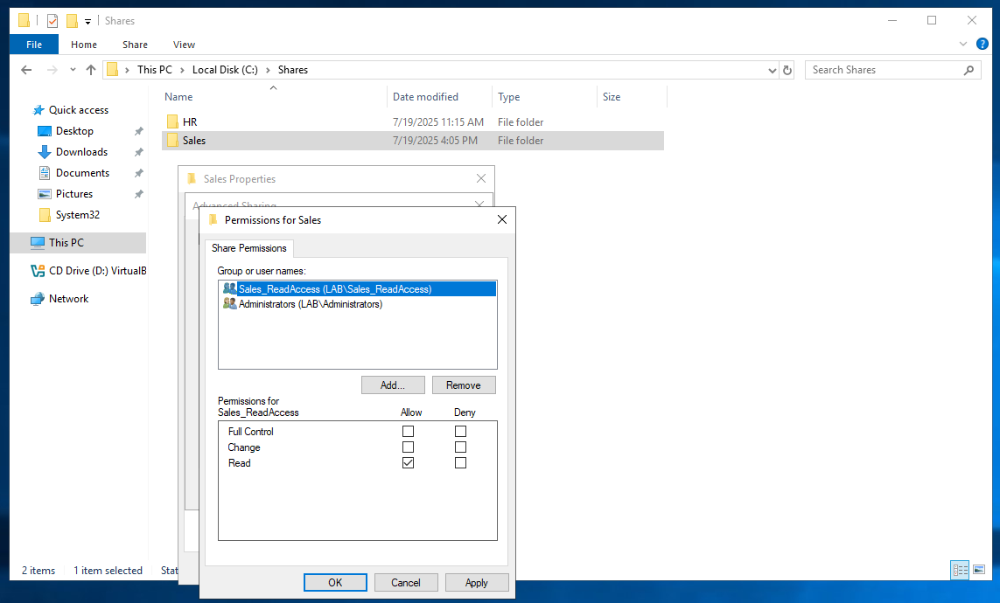

# Sales-HR-GPO-AccessControl

This project simulates a real-world environment with departmental separation (Sales and HR) to apply GPO restrictions, enforce access control via security groups, and implement login banners to align with NIST 800‑53.

---

## Overview
**Devices Used:** `Windows Server 2019`, `Windows 10`
- Devices are from same lab as past projects.
- DC was configured to follow NIST 800-53 standards and NIST RMF

---

## NIST 800-53 Mapping
| Control              | Mechanism                    |
|----------------------|------------------------------|
| AC‑2, AC‑3	         | AD groups + NTFS permissions |
| AC‑6	               | GPO desktop restrictions     |
| AU‑8	               | Login banner                 |
| CM‑2	               | GPO baseline vs. actual VM   |

---

## OU Design
Lab.local was configured with separate OUs for each department. This also includes an OU for department endpoints to maintain separation.
- `Lab-Users/HR_Users`
- `Lab-Users/Sales_Users`
- `Lab-SecurityGroups`
- `Lab-Computers`
- `Lab-Computer/Sales_Computers`

Ref 1: OU Structure

---

## Security Groups and Membership
Stored in `Documentation/GroupMemberships.csv`

| User       | Groups                                  |
|------------|-----------------------------------------|
| Lab Admin  | Domain Users, Administrators            |
| Sales Test | Domain Users, Sales_ReadAccess          |
| HR Test    | Domain Users, HR_ReadOnly               |

Security groups were created to manage file access permissions. Secuirty group is given access to share folders while users are then added to security groups. All access to shares should be handeled via a security group assignment.

Ref 2: Security Group Sales Memebers

---

## Folder Permissions
Share folders are department segregated for security. Sales users only have access to the Sales folder; access grated via security group. 

**Sales Folder**:
- Location: `C:\Shares\Sales`
- Group: `Sales_ReadAccess`
- Access: Read-only

**HR Folder**:
- Location: `C:\Shares\HR`
- Group: `HR_ReadAccess`
- Access: Read-only

Ref 3: Sales Share Permissions

Ref 4: Sales Share Security

---

## GPOs
| Name                           | Linked To      | Key Settings                           |
|-------------------------------|----------------|----------------------------------------|
| SalesUsers-DesktopRestrictions| Sales_Users OU | Disable CMD, Regedit, Control Panel    |
| HRUsers-DesktopRestrictions   | HR_Users OU    | Similar restrictions                   |
| Login Banner GPO              | Computers OU or Domain | Interactive logon text and title     |

Within Group Policy Management on DC-01 a GPO `SalesUsers-DesktopRestrictions` and `HRUsers-DesktopRestrictions` were created. Settings in the GPOs disabled Control Panel(Settings), Command Prompt, and Registry Editor for non admins. Along with program restrications department endpoints were linked to the policy to enforce a login banner.

Ref 2: Group Policy Management Structure

Ref 3: Login Banner

---

## Results
Verification of GPO enforcement in line with configurations. 

### Group Policy Results (Sales User)
`gpresult_sales.html` included in `/Documentation`.

Ref 5: Sales Group Policy Results

Key Policies Applied:
- Login Banner
- Desktop Restrictions
- Security Group Access

---

## Skills Practiced

- Active Directory OU Design, creating department specific OUs
- Role Based Access Control, using department specific security groups
- Group Policy Management, resticting system tools based on user OUs
- Configuring login banner; AU-8
- Security Hardening, using GPOs disabling unnecessary admin tool; AC-6
